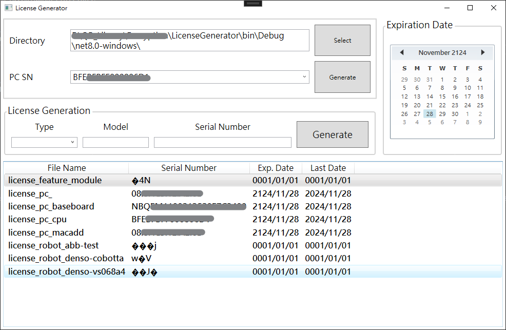

# Encryption
OpenSSL ver. 3.3.1 used in this repository, download the installer [here](https://slproweb.com/products/Win32OpenSSL.html).

Message Encrypt and Decrypt Example:
```C++
    #include <Encryptor.hpp>

    string msg = "test";
    Encryptor enc;
    auto st = clock();
    auto cipher = enc.Encrypt(msg);
    auto et = clock();
    cout << "Encrypt" << endl;
    cout << "  msg:" << msg << endl;
    cout << "  msg len:" << msg.size() << endl;
    cout << "  cipher:" << cipher << endl;
    cout << "  cipher len:" << cipher.length() << endl;
    cout << "  time cost:" << (et - st) << "ms" << endl;
    st = clock();
    auto res = enc.Decrypt(cipher);
    et = clock();
    cout << "Decrypt" << endl;
    cout << "  msg:" << res << endl;
    cout << "  msg len:" << res.size() << endl;
    cout << "  time cost:" << (et - st) << "ms" << endl;
```

## LicenseGenerator

This app design for generate license of the devices and features. The license file name by following format "license_{Type}_{Model}", and its content is encrypted cipher of serial number.



Usage
1. Select a working directory
  This app. will load and display the license in the selected directory. 
  The generated license also store in this directory.
1. Selcet a code from combobox as the PC SN, or type by yourself
  The code in combobox include CPU ID, Baseboard SN, local Mac address.
2. Select expiration date at bottom right corner for the licence that will be generated.
3. Press "Generate" button near PC SN
  The PC SN section will be automatically filled with the base board SN of the local machine. After press the "Generate" button, the license file of PC will be generated in selected working directory.
1. Press "Generate" button in "Device" or "Feature" section.
   The license file of device or feature will be generated by using encrypted PC SN as a encryption key(like a private key) .